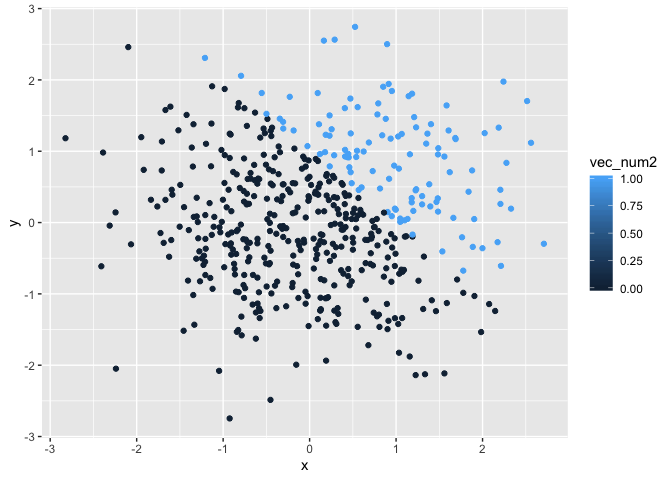

p8105\_hw1\_lc3391
================
09/17/2019

Problem 1
=========

Creating a data frame
---------------------

``` r
library(tidyverse)

la_df= tibble(
  norm_samp = rnorm(8),
  norm_samp_pos = norm_samp > 0,
  vec_char = c("a","b","c","d","e","f","g","h"),
  vec_factor = factor(c("low","med","high","low","low","med","high","high"))

)

mean(pull(la_df, norm_samp))
```

    ## [1] 0.1466755

``` r
mean(pull(la_df, norm_samp_pos))
```

    ## [1] 0.625

``` r
mean(pull(la_df, vec_char))
```

    ## Warning in mean.default(pull(la_df, vec_char)): argument is not numeric or
    ## logical: returning NA

    ## [1] NA

``` r
mean(pull(la_df, vec_factor))
```

    ## Warning in mean.default(pull(la_df, vec_factor)): argument is not numeric
    ## or logical: returning NA

    ## [1] NA

-   The mean of the numeric vector, norm\_samp, is 0.1466755;
-   The mean of the logical vector, norm\_samp\_pos is 0.625;
-   And NO mean could be taken for the character vector and factor vector.

converting variables from one type to another
---------------------------------------------

``` r
#convert the logical vector to numeric and multiply the random sample by the result
as.numeric(pull(la_df, norm_samp_pos))*pull(la_df, norm_samp)
```

    ## [1] 0.3204064 0.0000000 0.4680994 0.6571017 0.9321928 0.3065544 0.0000000
    ## [8] 0.0000000

``` r
#convert the logical vector to factor and multiply the random sample by the result
as.factor(pull(la_df, norm_samp_pos))*pull(la_df, norm_samp)
```

    ## [1] NA NA NA NA NA NA NA NA

``` r
#convert the logical vector to a factor and then convert the result to numeric, and multiply the random sample by the result
as.numeric(as.factor(pull(la_df, norm_samp_pos)))*pull(la_df, norm_samp)
```

    ## [1]  0.6408127 -0.2963206  0.9361987  1.3142035  1.8643857  0.6131088
    ## [7] -0.3448897 -0.8697400

Problem 2
=========

``` r
p2_df= tibble(
  x = rnorm(500),
  y = rnorm(500),
  vec_log2 = x + y > 1,
  vec_num2 = as.numeric(vec_log2),
  vec_fac2 = as.factor(vec_log2)
)
```

Short descprition
-----------------

-   the number of row in `p2_df` is 500;
-   the number of column in `p2_df` is 5;
-   the mean of the x is 0.0108743;
-   the mean of the y is 0.0203131;
-   the median of the x is 0.0186161;
-   the median of the y is 0.0307908;
-   the standard deviation of x is 0.981596;
-   the proportion of cases for which x + y &gt; 1 is 0.256;

Scatterplot
-----------

``` r
#A scatterplot for logical vector
ggplot(p2_df, aes (x = x, y = y, color = vec_log2)) + geom_point()
```


``` r
#A scatterplot for numeric vector
ggplot(p2_df, aes (x = x, y = y, color = vec_num2)) + geom_point()
```



``` r
#A scatterplot for factor vector
ggplot(p2_df, aes (x = x, y = y, color = vec_fac2)) + geom_point()
```


Comments on color scale
-----------------------

-   The first and third scatterplot have two color in the scale: one represnts TRUE and the other represents FALSE.
-   The second scatterplot uses a blue color bar to represent different scale. Smaller values associate with darker blue while bigger numbers associate with lighter blue.

``` r
ggsave("Problem2_firstplot.pdf",plot = ggplot(p2_df, aes (x = x, y = y, color = vec_log2)) + geom_point())
```

    ## Saving 7 x 5 in image
